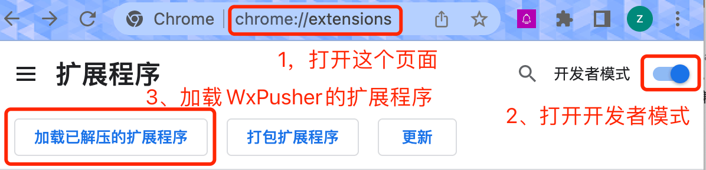
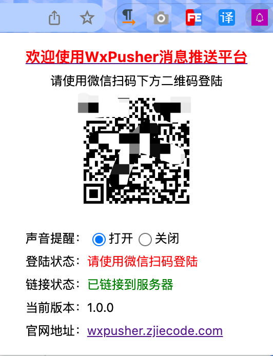

# wxpusher-chrome-extensions
WxPusher Chrome版客户端，兼容Window和Mac的谷歌浏览器，开着浏览器即可收到推送消息。

# 安装教程
1. 下载插件，你可以直接clone本项目，或者直接下载zip包，<a href="https://github.com/wxpusher/wxpusher-chrome-extensions/archive/refs/heads/main.zip">点击这里下载最新版本的插件zip包</a>；
2. 下载后解压到适当位置；
3. 进入chrome浏览器插件管理页：你可以在浏览器里面输入：chrome://extensions/ ，或者<a href="chrome://extensions/">点击这里</a>;
4. 点击右上角，开启“**开发者模式**”（_本插件目前没有上架到Chrome Store，所以需要通过开发者的方式安装_）；
5. 点击左上角“加载已解压的扩展程序”，选择第1步解压的文件夹；
6. 安装完会自动弹出微信扫码登录页面，使用微信扫码完成账户的绑定即可。

安装说明：

安装后，可以在右上角插件找到这个扩展，微信扫码完成登陆。

到这里，你已经完成了安装，所有发送到微信的消息，都会转发一份到浏览器客户端。

# 其他说明
1. 安装完成后可能出现“Manifest version 2 is deprecated, and support will be removed in 2023. See https://developer.chrome.com/blog/mv2-transition/ for more details.”提示，无需理会；  
2. 如需更换账号，请卸载插件后重新安装。
